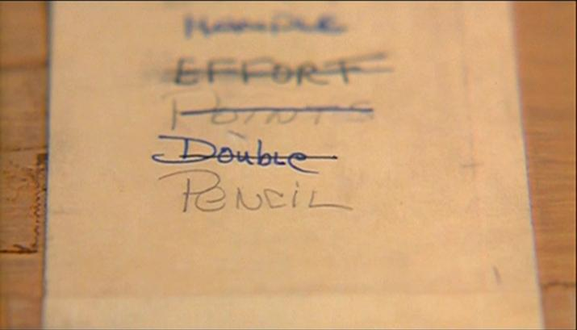
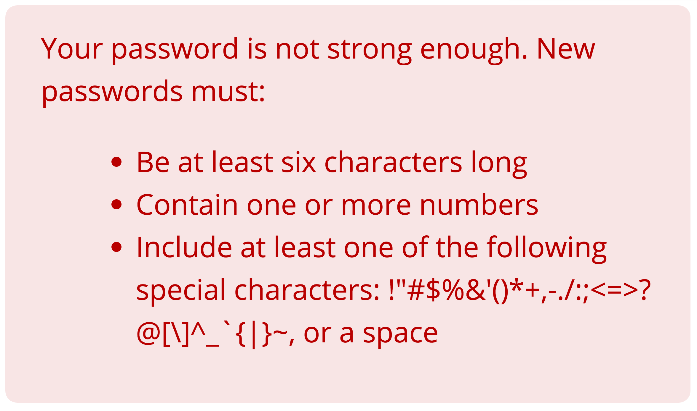

build-lists: true
autoscale: true

# A br1ef h1st0ry of P@ssw0rds

---

# Hello!

## Rob N ★

Email: robn@fastmail.com
Twitter: @robn
Github: @robn

<br>

https://robn.io/passwords-compcon-2016/

^Good morning, welcome, thanks for being here

^My name is Rob. You can call me N or ★, as you like

^There's some places to talk at me. Please do!

^These slides and links to anything I mention here will be at this URL, so don't stress about trying to write anything down

^Time for questions at the end

---

# What I did

* 1998 - Started a Computer Science degree

* 1999-2012 - Monash Uni, doing mail and web stuff
  * Netscape Mail → Lotus Notes → Google Apps

* 2012-today - FastMail, doing mail and web stuff

* I do operations - keeping the lights on

^So I'm kind of an old man now

^★ Back in 1999 I was studying Computer Science at Monash Uni. Then I got a job helping to deploy their new mail system.

^★ That kind of lasted a while. Over the time I went on to lead a small team doing that job, and took us through three mail systems

^★ Then in 2012 I went to FastMail, doing basically the same thing, except that now our customers pay us directly and we focus only on email

^★ I work in operations, which is about keeping everything running smoothly. On any given day I build servers & networks, write tools, wrangle databases, stare at graphs, talk to customers, fiddle the stylesheets, and everything in between

---


^All of these have some part to play in security of our system as a whole, and that's crucial to understand because if there's one thing that email users don't like, its their email being made public

^And then you end up in the news and they use stupid pictures like this

^All of this talk is stuff I've learned on the job. Fortunately none of it the hard way.

^And I'm telling you about it because almost all of you will at some point work on something that needs to control access to stuff, and you'll run into this stuff and you don't want to get it wrong

---

# I am not a security expert


^That said, I'm not a security expert

^But that's ok, because you're probably not either

^It does mean that you need to go and do your own research and make sure I'm not spinning you a bunch of lies

^But that's good, because you'll know what's going on with your own services

---

# Passwords

^So passwords

^They're the weakest part in the security of your service, because they're largely outside of your control

^And so they're most important part of your service

^So lets talk about passwords

---

# Passwords<br>are terrible

^Passwords are terrible

^We all know this

^The thing I discovered is...

---

# Passwords<br>have always been<br>terrible

^[PAUSE]

^They've ALWAYS been terrible, since the beginning

^So lets go back in time...

---

# 1961

## First use of passwords


* MIT's "Compatible Time Sharing System" (CTSS)
* Allowed a running task to be interrupted so a higher priority task could be run
  * and then, once finished, the original task continues
* Usernames & passwords used to protect files and allocate run time

^The first use of passwords (as we know them) was at MIT in 1961

^IBM would give MIT new computers provided IBM could have some portion of its run time

^IBM tasks had top priority - current task gets cancelled

^★ Work starts on the "Compatible Time Sharing System"

^★ Timesharing, just like modern multitasking. Interrupt a task to run another, and once finished, pick up where we left off

^★ Passwords to limit access to files & allocate run time

^All very sensible

---

# 1962

## First password hack


* Allan Scherr, Ph.D student
* Allocated four hours per week, needed more for his simulations
* Print service ran as a privileged service
* Wrote a program to request a printout of the password file
* Gave everyone a copy to cover his tracks

^One year later, the first password hack

^★ Alan Scherr was a Ph.D student

^★ Allocated four hours a week but wanted more

^★ The print service happened to be able to read any file in the system

^★ So he writes a program that asks the print service to print the password file

^★ Gives everyone a copy to cover his tracks

^Great, we're a year in, we're doing well

---

# 1966

## First password leak


* One user editing the password file
* Another user editing the MOTD file
* Editor used a hardcoded file for temp storage
* Password file was written to MOTD file
* Displayed to users on login

^Four years later the first unintentional password leak

^★ One user editing the password file

^★ Another user editing the message-of-the-day file. This is the text displayed when you login

^The editor works much like modern editors do - when you save, contents written to a temporary file, then moved into place

^★ It used the same temp file for all editor sessions

^★ So the password file got written to the MOTD

^★ and was displayed to everyone on login

^The emergency fix was to crash the machine. This happened at 5pm on a Friday. Some things never change

---


^[PAUSE]

^Great, excellent.

^Five years in and pretty much everything that could go wrong with passwords has

^But, we learned...

---

# 1966-1974

## Hashed passwords


* Experiments with "encoded" passwords in CTSS, MULTICS and UNIX
* Renewed interest in one-way hash functions
  * Don't store the password, store a value derived from the password
  * Do the same thing with the login password, compare
* Robert Morris implements `crypt()` in 6th Edition UNIX

^The MOTD leak made it clear that some sort of non-plaintext storage was necessary

^★ Various experiments with encoding led to the use of one-way hash functions

^★ The way these work is to store a "hash" (a value derived from the password), and at login, run the function again on the password the user gives us, and compare the hashes. The plaintext password is never stored

^★ First widely-available implementation is in 6th Edition UNIX

^I wanted to find out more. I found a PDP-11 & UNIX emulator written in Javascript that runs in the browser. Kind of ridiculous really. This is the output of me changing Ken Thompson's password and viewing the stored hash in the password file

---

# 1979

## Password Security: A Case History



^Robert Morris (creator of `crypt`) & Ken Thompson (creator of the rest of UNIX) did a review of the password system and security model in UNIX

^It's a great paper. It's only four pages. It has everything they'd learned so far. It's well worth reading

^They included an analysis of the kinds of passwords people use

---

# Password Security: A Case History


^I'm not sure if you can see this

^[PAUSE, TIME TO READ]

^~3300 passwords reviewed

^~2800 (86%) were garbage: simple alphanumerics <=6 or dictionary words, or both

^So that's just great; we're less then 20 years in and crappy passwords are the norm

^But that was nearly 40 years ago. Obviously things are better now, right?

---

# 2015

## You won't believe what happened next


* SplashData's 5th annual "Worst Password List"
* 2m+ leaked passwords analysed

^SplashData make a password manager product

^★ Every year publish a list of worst passwords

^★ 2015 list released in Feb 2016, analysed over 2m passwords from various breaches and leaks

---

# 2015

## Ten popular passwords you need to know right now


```


```

^It's about as terrible as you'd expect

^Here's the top 10

---

# 2015

## Ten popular passwords you need to know right now


```
123456


```

^[PAUSE, CONSISTENT PACING]

---

# 2015

## Ten popular passwords you need to know right now


```
123456
password


```

^[PAUSE, CONSISTENT PACING]

---

# 2015

## Ten popular passwords you need to know right now


```
123456
password
12345678


```

^[PAUSE, CONSISTENT PACING]

---

# 2015

## Ten popular passwords you need to know right now


```
123456
password
12345678
qwerty

```

^[PAUSE, CONSISTENT PACING]

---

# 2015

## Ten popular passwords you need to know right now


```
123456
password
12345678
qwerty
12345
```

^[PAUSE, CONSISTENT PACING]

---

# 2015

## Ten popular passwords you need to know right now


```
123456        123456789
password
12345678
qwerty
12345
```

^[PAUSE, CONSISTENT PACING]

---

# 2015

## Ten popular passwords you need to know right now


```
123456        123456789
password      football
12345678
qwerty
12345
```

^[PAUSE, CONSISTENT PACING]

---

# 2015

## Ten popular passwords you need to know right now


```
123456        123456789
password      football
12345678      1234
qwerty
12345
```

^[PAUSE, CONSISTENT PACING]

---

# 2015

## Ten popular passwords you need to know right now


```
123456        123456789
password      football
12345678      1234
qwerty        1234567
12345
```

^[PAUSE, CONSISTENT PACING]

---

# 2015

## Ten popular passwords you need to know right now


```
123456        123456789
password      football
12345678      1234
qwerty        1234567
12345         baseball
```

^[PAUSE]

---


^[PAUSE]

^<sigh>

^Left to their own devices, people are going to choose crappy passwords

^It's been almost 60 years. Its not going to change

^There are things we can do to improve the situation

^But first we have to ask...

---

# ¯\\\_(ツ)\_/¯

^Why is any of this even a problem? Why should we care?

^There's a bunch of reasons

---

# You (human)

^If you're a person (seems likely), then having a bad password is bad for you

---

## Your password is:

# Easy to guess

^If I know some things about you, I have a better chance of guessing your password

^Thos things are pretty easy to find

^Your name and location and hobbies and dreams are all over your Facebook and Twitter accounts

^You'd probably tell me these facts if I asked you. Other people definitely will if I pretend to be you

^There's even a little bit of info on your conference badge

^Its all there if I want it badly enough

---

## Your password is:

# Easy to brute-force

^Even if I can't guess it, I can start making guesses using eg dictionary words

^So if your password is based on dictionary words, I'm far more likely to stumble upon it

^Even more of a problem if I can test passwords on my local machine. That might be possible if I've managed to get a copy of a password database. More on that later

---

## Your password is:

# Likely to be reused

^Why do people make bad passwords?

^Because they're easy to remember!

^If you don't have a good system for remembering your passwords, you're more likely to use a password you can remember everywhere

^If I manage to discover your password, I've now got access to lots of your accounts

---


^And God help you if I got the password to your email account, because every other account you have sends its password recovery emails here

^As a rule, the best password is the one you can't remember. Use a pasword manager.

^[PAUSE]

---

# You (service)

^If you're running a service, your users having bad passwords is bad for you

---

## Your service is:

# Responsible

^Your users expect you to protect their data. That's much harder for you to do if they're forever getting their accounts hacked

---

## Your service is:

# Trustworthy

^Pretty much every service you might build these days is going to have some kind of sharing or collaborative features

^You want to be known as trustworthy. You want a good reputation.

^If your users have bad passwords and keep getting their accounts hacked, then your service becomes known as dodgy. A haven for spammers.

^You'll lose existing customers. You won't get new customers

^Your reputation disappears

---

> My good opinion once lost is lost forever.
> -- Mr. Darcy, _Pride and Prejudice_

^And as we know, once you lose your good reputation, its incredibly difficult to get it back

^[PAUSE]

---

## Your service is:

# At the mercy of other services

^You might do all the right things, but if your users are using the same terrible password on yours and other services, and one of those is hacked, then your service is at risk through no fault of your own.

^[PAUSE]

---

# You (pet)

^And if you're a pet, your human having bad passwords is bad for you too

---


^[PAUSE]

^Everyone loses with bad passwords

^Especially the people that create them

---

# We can help


* Encourage high-quality passwords
* Keep passwords secret
* Make passwords useless

^We can help!

^[PAUSE]

^This talk is about the three big things we can do to improve the situation

^★ We can encourage and help our users to produce good quality passwords

^★ We can make sure those passwords are hard to use in the event that an attacker gets hold of our password database

^★ And we can make it so that knowing a password still isn't enough

---

# Encourage high-quality passwords

^So how can we encourage users to create high-quality passwords?

^[PAUSE]

---

# Password policies

^Easy, we have a password policy!

---

# A traditional password policy

* Must be at least 8 characters
* Must contain at least one upper-case character
* Must contain at least one lower-case character
* Must contain at least one number
* Must contain at least one symbol

^So lets make one!

^★ 8 characters

^★ one upper-case character

^★ one lower-case character

^★ one number

^★ one symbol

^This sort of password policy is pretty common. It must work well, right?

^[PAUSE]

---

# No


^Not really, no

^[PAUSE]

---

# A traditional password policy

* Good password: `P@ssword1`
* Bad password: `4u8zvbvabxmdx56s`

^Given that policy

^★ this is a good password

^★ and this is a bad one

^[PAUSE]

---


^[PAUSE]

^It has to go

^This is the wrong way to think about password quality

---

# Password strength

* Isn't about the length of a password
* Isn't about the number of weird characters

<br>

* Well, not exactly

^What we're really interested in is the strength of a password

^★ Which isn't about the length

^★ And isn't about the number of weird characters

^[PAUSE]

^★ That's not entirely true. Those things are important, but there's more to it

---

# Randomness


^We're really interested in the amount of randomness in a password

^Randomness recap. Flip a coin 100 times. A truly random coin should get you about 50 heads, 50 tails.

^Or another way: choose a random number from 1-100. If your selection is truly random, it will take me 50 guesses on average to guess your number.

---


^[PAUSE]

^If your choice isn't truly random though, it becomes much easier for me to guess. Especially if 4 is popular this month.

^It's the same for passwords. If your password isn't random, its easier for me to guess. And if Pokemon Go is still a thing then your password is probably some variation on the name of your favourite Pokemon

^Making a password longer or using more characters increases the number of possible of passwords, just as choosing a number from 1-1000 has more possibilities than 1-100

^But 4 is still 4

---


^And Snorlax is still Snorlax

^[PAUSE]

^And please don't talk to me about Pokemon because I really have no idea what I'm talking about

---

# Strength test


* Test the password and tell the user how strong it is
* Considering common templates, words, sequences, etc
* [zxcvbn](https://github.com/dropbox/zxcvbn) by Dropbox

^★ Instead of relying on the user to follow a set of rules, actually test the password they want and give them some feedback about it

^★ Your password checker can consider common words, phrases, sequences, whatever else and adjust the score appropriately

^There's some research to suggest that this feedback encourages users to try and create a stronger password. Gamifcation of passwords!

^★ If you're looking for a place to start, try "zxcvbn" by Dropbox. This is the one we use at FastMail and we now don't have any other password policy in place, just a minimum required strength

---


^Awesome, great work everyone, give yourselves a high-five!

^All our users now have great passwords, right?!

^[PAUSE]

---

# Keep passwords secret

^But we still have to keep them secret

^[PAUSE]

---


^[PAUSE]

^So let's talk a bit about data breaches and leaks

^Here we're talking about personal data, including passwords, being leaked from some online service in some way

---

# Have i been pwned?

## haveibeenpwned.com

^There's this great site called "Have I been owned?", by a guy called Troy Hunt. He gets hold of user data from leaks by whatever means and loads it all into a searchable database (with personal information omitted, of course)

^You can register your email address and you'll be sent an email when your address is seen in a breach

---

# Have i been pwned?


^So the front page shows the top ten breaches by number of records

^[PAUSE]

^Lots of big names there that you'd expect to know what they're doing

---

# Have i been pwned?


^And hundreds more. The twitter feed is rather sobering. This is just a sample from the last few months

^[PAUSE]

---

> How can we help people impacted by data breaches without making life worse for them?
> -- Troy Hunt, [Have i been pwned?](https://haveibeenpwned.com/)

^Troy asks this question often:

^How can we help people impacted by data breaches without making life worse for them?

^[PAUSE]

^And that's real thing here. Ultimately, our users are trusting us to keep their data safe

^Hopefully your user and password data will never get out but as we saw, it happens to services of all sizes and reputations. You should assume that it will happen and prepare for it

^So how can you make your stored passwords as useless as possible to an attacker?

---

# Your opponent


^[PAUSE]

^This is your opponent. Maybe

^This person looks like they could be from the internet anyway

---

# Your opponent


## has:

* Stored password (hashes)
* Email address / username
* Other personal info
  * Physical address
  * Payment details
  * Actual content
  * Control of your account
  * ...

^They've got hold of a data dump from your service

^★ They have your stored passwords

^★ and the usernames or email addresses to go with it

^★ and maybe some other stuff, like your address, credit card details, the actual stuff in your account. This will vary. It's not entirely relevant to a discussion about passwords except to say that this is part of why its important that your passwords are random. The more info I know about you, the easier it is to figure out what you'd choose for a password

---

# Your opponent


## wants:

* Plaintext password

^Out of all this, they want

^★ The plaintext password

^And that's all. The rest is irrelevant.

^(Unless they're trying to get credit card details, or set up to do a bunch of identity fraud, but that's a whole different talk)

---

# Your opponent


## needs:

* Time
* Money

^On the way there, they have two main constraints

^★ Time. Once the breach is discovered, its only a matter of time before the service provider starts changing passwords, locking accounts and before users start changing their own passwords on other accounts.

^★ Money, or rather, the amount of computing power the attacker can buy. Once this was about having powerful computers physically available, but these days its about the amount of time you can buy on a cloud service

^Our goal is push these costs up as high was we can, hopefully out of reach

^[PAUSE]

---

# Hash functions


^We talked about hash functions earlier. Instead of storing the plaintext password, we store a value derived from the password.

^Since every password has to go through that function, we can use it to make things harder for an attacker

---

# Choosing a hash function

* Cryptographic hash functions
  * Pre-image resistance
  * Second pre-image resistance
  * Collision resistance
* Key-derivation function
  * Produces a high-randomness output from a low-randomness input
  * Slow 👍

^There's lots of options available

^We're interested in some specific properties

^★ Cryptographic hash functions, generally, try to arrange it so that there's only one input for any given output, and so that given an output, you can't find the input. These are the fancy words for that

^★ Key-derivation functions produce a high-randomness output (key) from an arbitrary input. This takes time to do, which is exactly what we need

---

# Speed test


* "Bad" functions
  * `sha512  203252/s`
  * `sha256  456621/s`
  * `sha1    512821/s`
  * `md5    2173913/s`

* "Good" functions
  * `bcrypt    14.9/s`
  * `scrypt    21.7/s`
  * `pbkdf2    21.8/s`

^[PAUSE]

^We don't have time for a lot of detail

^But I do have some benchmarks. Single-threaded, Perl 5.24, hashes implemented in C, on this 2013 MBP

^★ These are bad password hash functions. They're perfectly fine cryptographic hash functions (well, maybe not MD5 anymore), but they're too fast to protect against an direct brute-force attack.

^★ These are good password hash functions. It takes time to compute many hashes, but its not too bad when computing just one, as we would when a user is logging in

---

# Further reading


^Speed (or lack of) is the most interesting property of a hash function for passwords as far as we're concerned

^There's lots more stuff you need to think about when selecting a hash function. I used to have slides about this. They were long and boring and you would have needed to go and read up anyway

^Stuff like salts and rainbow tables, parameters for modern hardware, new and improved functions, how new technology might introduce new ways to attack old functions, and so on

^Search for "password hashing functions"; there's plenty of good info out there. I've put some links on the talk website too

^Otherwise, just look for the hashing library that recommended for your language; its probably fine

---

# I got pwned!


^[PAUSE]

^So while I was writing this talk I receieved an email

---


^[PAUSE]

^last.fm is a kind of social network for music. you share the music you're listening to with others

^I haven't used it in years. I'd forgotten about it

^Apparently they were hacked in 2012. The password database was copied and is apparently only just surfacing now

^Fun facts: 38 million passwords, stored as unsalted MD5 hashes. Some analysis I saw claimed to have broken 96% of the hashes in two hours. I believe it

^~250k of passwords were "123456". next most popular was "password", at ~90k

---

# `n8mlyF75wPjFP0Kl`

^This was my password. Generated by my password manager. I haven't used it anywhere else so the breach is not significant

^But of course I should still change it

---

# `udvrcqt3wk3headj`

^So I got my password manager to generate a new one. This is what it came up with.

^This particular one is 16 chars chosen from a range of 32. It's the same kind that we use at FastMail for one of our login features

^Its a strong password by pretty much any measure

---



^[PAUSE]

^<sigh>

^Except this measure

^Thanks a lot

^Tweaked password manager to produce the format its expecting

^And now I can go back to not using this account

^That's fine for me, but...

---


^[PAUSE]

^I wonder how many people ended up having a really bad day because some the wrong hash function was chosen?

^Try not to make your users have a bad day

^[PAUSE]

---

# Make passwords useless

^[PAUSE]

^So here's an idea. What if we could make it so that even you manage to get hold of someone's password, you can't do anything with it? What if we could make it so it only works for the account owner?

^We can! Sort of...

---

# Two-factor authentication


^We do that with two-factor authentication

^Here's Bono with his two factors. This is not relevant, it's just a picture from a talk I did about two-factor auth and I wanted to use it again

^[PAUSE]

^The idea with 2FA is that to login, you have to present two different things

---

# Something you know


^[PAUSE]

^Something you know: that is, your password

---

# Something you have


^[PAUSE]

^Something you have

---

# Something you have


* Some physical thing that only you have access to
* Previously registered with the account
* Your phone
 * SMS
 * TOTP
* A standalone security device
 * U2F
 * TOTP

^★ Some physical item that only you have access to

^★ That has been previously registered with the account

^★ That might be an app on your phone

^★ Or a separate standalone security device

^These are the common ones for consumer-level devices, but there are others

---


^[PAUSE]

^The easiest way to explain this is to see it in action

^Using FastMail as an example because that's what I know

---

# Username & password


^You start if in the normal way, asking for a username and password

^If the password is wrong, you reject outright

^Otherwise, you request a second factor from one of the methods the user has previously registered

---

# Second factor: SMS


^SMS is a method you might be familiar with. As well as Google and other services, banks often use this style. When you make a large transfer or change some personal info, you have to enter a code to confirm

^Service generates a code, sends it to your phone. You recieve it and type it in, and that proves you control the number

^[PAUSE]

---

# Second factor: TOTP


^This is a TOTP device. TOTP is a "time-based one-time password"

^The device and the server have a shared key, established at registration

^The device generates a 6-digit code, derived from the key and the current time, and is valid for a short amount of time

^I've got some of these devices with me; come and find me if you want to have a look

^[PAUSE]

---

# Second factor: TOTP


^This is a TOTP app. It does exactly the same thing. Of course it has more storage available, so it can handle multiple accounts

^[PAUSE]

---

# Second factor: TOTP


^At login time, the user gets the current code from the device or app, and type it in

^The server generates its own code from the key and current time, and compares

---

# Second factor: U2F


^U2F is "universal two-factor". They're USB devices that you plug in

^They have some activation method, either a button or touch pad, or the actual act of inserting the device

^Inside, there's a bunch of modern public-key crypto. They're kind of the gold standard for two-factor auth

^[PAUSE]

---

# Second factor: U2F


^And they are standard!

^This is a U2F device designed and built by a chap named Conor Patrick

^Hardware and software is all open source

^He's selling a small run of them at the moment. Mine are on their way!

^[PAUSE]

---

# Second factor: U2F


^So at login, you get asked to activate the device. You just press the button

^The server sends a challenge, the browser asks the device to sign it, and then returns the signature to the server to verify

^I get ridiculously excited about U2F. Its rare that you find something that is best technical choice and has the best user experience at the same time

^[PAUSE]

---

# Bonus prize round!


^This is a Nitrokey U2F device

^I've got 50 of these to give away

^Use it to secure your FastMail, Github, Dropbox, Google, etc account

^Or use it to learn how to add support to your service or app

^One condition: you have to tweet, blog or otherwise say something public about what you did. We're trying to make it more visible

^Come and find me later to get one and lets talk about it


---

# Why two-factor?


^[PAUSE]

* Make the password useless by itself
* Even when leaked or stolen
* But make the second factor do nothing by itself
* So you can lose your phone but still keep your account safe

^Why are we doing this?

^★ We've now made the password useless without the second factor

^★ So if it does leak, the account is still secure

^★ But the second factor can't do anything by itself

^★ So there's no problem if you lose it

---

# We helped!


^[PAUSE]

^Congratulations, we did it!

---

# We helped!


* High-quality passwords
 * Sensible password policy and strength feedback to user
* Passwords stored securely
  * Good hash function with salts
* Passwords not the whole story
  * Two-factor authentication

^★ Our users have a chance of creating a good password

^★ We know how to store it securely with the best chance of keeping it safe if it ever leaks

^★ We've got 2FA available so the password alone can't access the account

---


^[PAUSE]

^Everything is great now, right?

^Well... no. Because remember where we started?

---

# Passwords<br>are terrible

^[PAUSE]

^Passwords are fundamentally terrible

^Everything we've talked about today is just trying to make the best of a bad situation

---


^[PAUSE]

^But we shouldn't despair!

^There's smart people working on the problem. New tech and new research is coming out all the time

^Maybe you'll be the one to solve it!

^And for the rest of us, there's loads we can do right now to make things better for everyone

---

# Th@nk y0u!

^Thanks a lot!

---

# Th@nk y0u!

## (don't forget your U2F key)

^Don't forget to come get your U2F key
